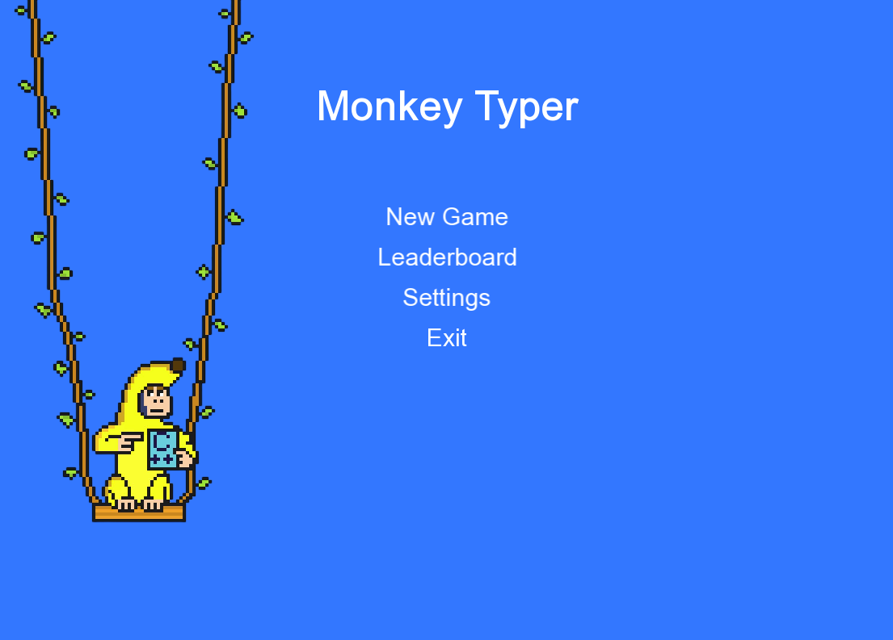
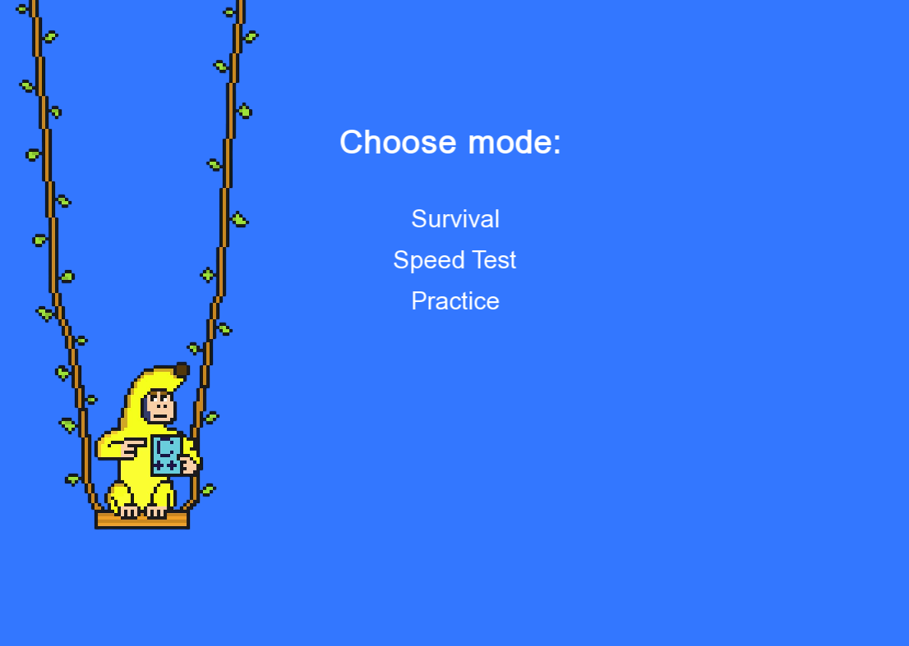
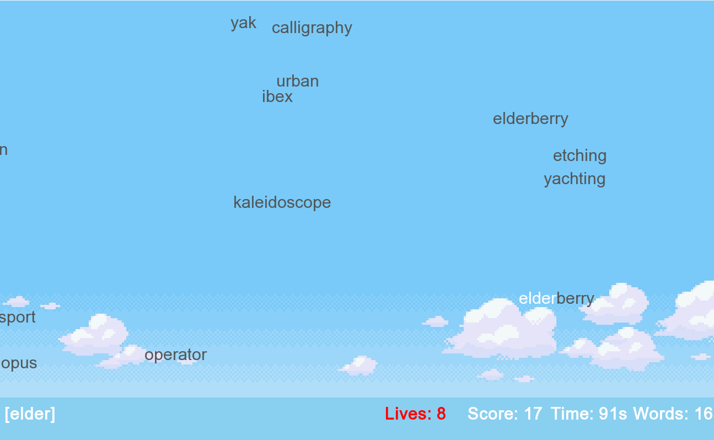
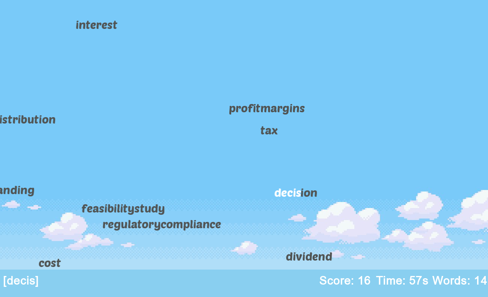
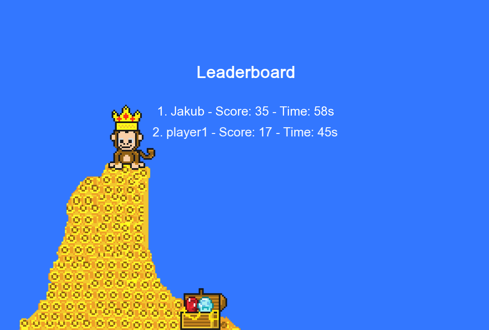
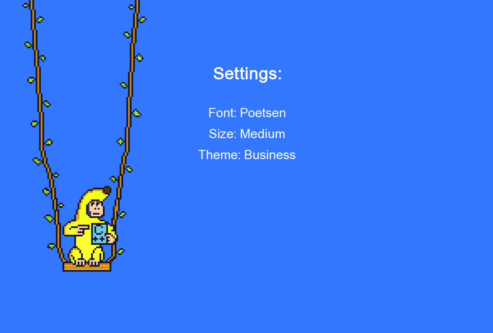

# MonkeyTyper – Interactive Typing Game Trainer




---

## Table of Contents
1. [🔎 Project Overview](#1-project-overview)  
2. [🛠️ Key Features](#2-key-features)  
3. [🧰 Tech Stack](#3-tech-stack)  
4. [🏗️ Architecture & Game Logic](#4-architecture--game-logic)  
5. [📦 Installation & Usage](#5-installation--usage)  
6. [🎮 Gameplay & Controls](#6-gameplay--controls)  
7. [💾 Save System & Leaderboard](#7-save-system--leaderboard)  
8. [🎨 Fonts, Sizes & Themes](#8-fonts-sizes--themes)  
9. [📁 Assets & File Structure](#9-assets--file-structure)  
10. [🛣️ Roadmap](#10-roadmap)

---
## 1. Project Overview

MonkeyTyper is a fast, responsive typing game built in C++20 with SFML. It lets you sharpen your typing in Practice mode or compete for high scores in Survival. With real-time feedback, custom themes, and a local leaderboard, it’s both functional and fun. Just clone, build, and play—no setup needed.

---

## 2. Key Features

- 🧠 Typing trainer with real-time animation and sound feedback
- 🎮 Game modes:
  - **Survival**: Limited lives, growing difficulty
  - **Speed Test**: Score as much as you can in time
  - **Practice**: Free-typing with no penalty
- 💾 Save/Load game state with `Ctrl + S / Ctrl + L`
- 🏆 Leaderboard stored in text file and sorted by performance
- 🎨 Configurable font, size, theme (word category)
- 🔊 Audio feedback for correct hits

---

## 3. Tech Stack

| Component   | Technology                |
|------------|---------------------------|
| Language    | C++20                     |
| Build       | CMake ≥ 3.27              |
| GUI/Audio   | SFML 2.6.1 (via FetchContent) |
| Formatting  | fmtlib 10.2.1             |
| File I/O    | `std::fstream`, `std::filesystem` |
| Dev Tools   | CLion, CMake, Git         |

---

## 4. Architecture & Game Logic
```
main.cpp
├── Initializes window, sounds, textures
├── Game loop + state handler
│
├── Menu (Menu.h/.cpp)
│   └── Main menu, settings, leaderboard UI
│
├── ScoreBar (ScoreBar.h/.cpp)
│   └── Score, lives, word count, user input
│
├── FileManager (FileManager.h/.cpp)
│   └── Load/save words, state, leaderboard

Game functions:
├── initializeTextTypeWords()
├── handleGameStateEvents()
└── gameOn()
```

---

## 5. Installation & Usage
MonkeyTyper builds all dependencies automatically using CMake's `FetchContent`.  
No need to manually install SFML or fmtlib.

### 🔧 Requirements

- 🧩 C++20 compatible compiler (e.g. GCC ≥ 10, Clang ≥ 11, MSVC 2019+)
- 🛠️ CMake ≥ 3.27

### 🔨 Build Instructions

```bash
git clone https://github.com/jkot16/monkey-typer.git
cd monkey-typer
cmake -B build -DCMAKE_BUILD_TYPE=Release
cmake --build build
./build/MonkeyTyper   # or MonkeyTyper.exe on Windows
```

---

## 6. Gameplay & Controls

| Action               | Input                                 |
|----------------------|----------------------------------------|
| Start Game           | Click “New Game” in main menu          |
| Select Mode          | Survival / Practice *(Speed Test – WIP)* |
| Type Words           | Keyboard                               |
| Save Game            | `Ctrl + S`                             |
| Load Game            | `Ctrl + L`                             |
| Adjust Speed         | `Ctrl +` / `Ctrl -` *(in Practice)*    |
| Pause / Continue     | Press `Esc` to pause, click anywhere to resume |
| Enter Player Name    | After Survival → type → press `Enter`  |

> ℹ️ *Speed Test mode is currently a placeholder and will be implemented in a future update.*

- Modes Page


- Survival with default settings


- Practice with Poetsen font and business theme


---

## 7. Save System & Leaderboard

- 💾 Press `Ctrl + S` to save the current game state:
  - Active word positions  
  - Current input, score, time, lives  
  - Font, size, and theme settings  

- 📥 Press `Ctrl + L` to restore your last saved session

- 🏆 Leaderboard is stored in `assets/leaderboard.txt`
  - Automatically sorted by:
    - Number of words (descending)
    - Then by time (descending)
  - Only top 10 scores are kept

- ⌨️ After Survival mode ends, you're prompted to enter your name — it will be saved if you confirm with `Enter`.



---

## 8. Fonts, Sizes & Themes

MonkeyTyper allows UI and gameplay customization via the **Settings** menu.  
You can adjust how words look and which theme is used during Practice mode.

| Setting     | Available Options                  |
|-------------|-------------------------------------|
| **Font**    | Arial / Poetsen / Playfair          |
| **Size**    | Small / Medium / Large              |
| **Theme**   | Default / Programming / Business     |

Each theme changes the word list shown during Practice mode.  
Font and size affect all in-game text and are saved as part of your game state.



---

## 9. Roadmap
For more upcoming features and tracked improvements, see:  
👉 [GitHub Issues for Monkey-Typer](https://github.com/jkot16/monkey-typer/issues)
